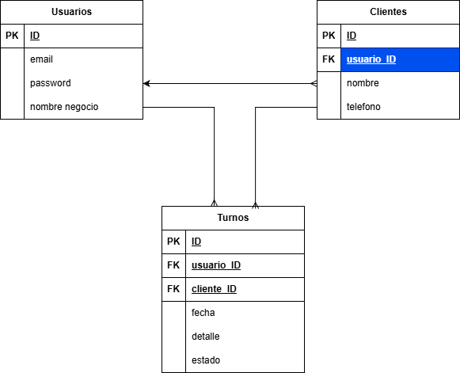
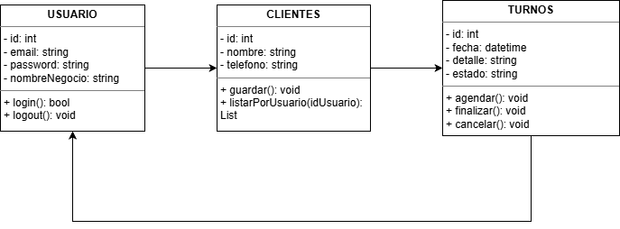

# Sistema de Gestión de Turnos SaaS (Multi-tenant)

Sistema web diseñado para la gestión integral de clientes y turnos, implementando una arquitectura **SaaS (Software as a Service)** con aislamiento lógico de datos.

## Características Principales

* **Arquitectura Multi-tenant:** Base de datos compartida con discriminador `usuario_id` para garantizar la privacidad entre inquilinos (Peluquería, Taller, etc.).
* **Gestión de Estados:** Ciclo de vida completo de turnos (Pendiente -> Finalizado/Cancelado).
* **Interfaz Reactiva:** Frontend SPA (Single Page Application) utilizando JavaScript Vanilla y Fetch API.
* **Seguridad:** Autenticación simple y validación de propiedad de datos en cada endpoint del Backend.

## Stack Tecnológico

* **Backend:** Python 3 + Flask
* **Base de Datos:** MySQL (Driver: `mysql-connector-python`)
* **Frontend:** HTML5, CSS3 (Diseño Flexbox/Grid), JavaScript ES6
* **Diseño:** Interfaz moderna con Split-Screen Login y Dashboard interactivo.

## Instrucciones de Instalación

1.  **Requisitos:** Tener instalado Python 3 y XAMPP (con MySQL activo).
2.  **Instalar Dependencias:**
    ```bash
    pip install flask mysql-connector-python
    ```
3.  **Configuración de Base de Datos:**
    Ejecutar el script de inicialización para crear la BD y cargar usuarios de prueba:
    ```bash
    python crear_bd.py
    ```
4.  **Ejecución:**
    Iniciar el servidor de desarrollo:
    ```bash
    python app.py
    ```
5.  **Acceso:**
    Abrir el navegador en `http://127.0.0.1:5000`

## Arquitectura del Sistema

### Diagrama Entidad-Relación (Base de Datos)


### Diagrama de Clases (Lógica)


## Usuarios de Prueba

| Negocio | Email | Contraseña |
| :--- | :--- | :--- |
| **Peluquería Juan** | `juan@peluqueria.com` | `1234` |
| **Taller Ana** | `ana@taller.com` | `1234` |

---
*Trabajo Práctico Final - Proyecto Informático 2025*